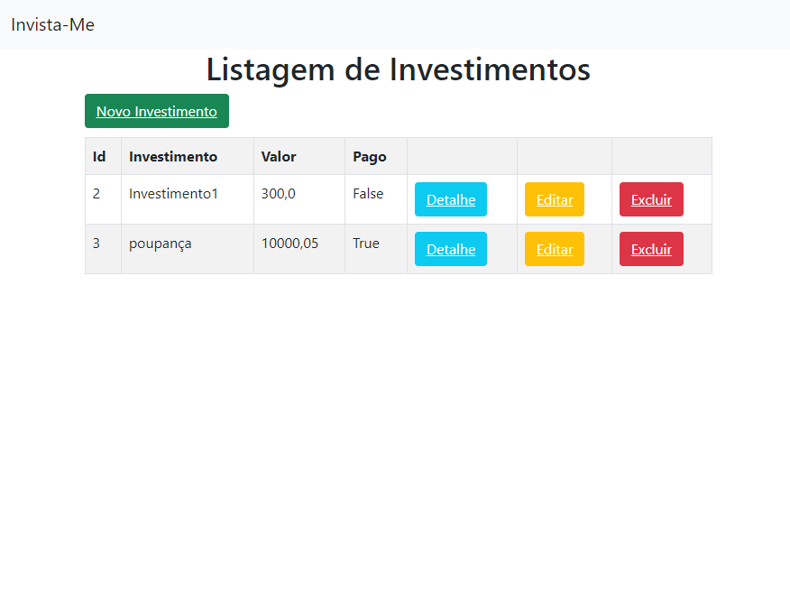

    

## -  Objective 🛠️
This project was created for an instagram coffee influencer, so it can have their afilliated links all on the same page and divided by category

## - Visit the site
The site is online! you can visit it [here](https://investimentos-me.herokuapp.com/)! If you have any problem please contact me! ✉️

## - Technologies 🚀️
On this project i used **Django** to build the app and **Heroku** to make it online, for the database i used **sqlite**.
